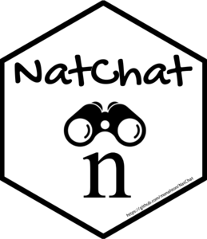

<!-- README.md is generated from README.Rmd. Please edit that file -->

# NatChat: Chatting with Nature Journals Current Issue using a local Language Model 

[](https://www.repostatus.org/#active)
[](https://www.gnu.org/licenses/gpl-3.0)
[](https://github.com/monahton)
[](https://github.com/monahton/NatChat/issues)
[](https://cran.r-project.org/)

[](https://github.com/monahton/GencoDymo2/commits/main)

------------------------------------------------------------------------

## 📦 Overview

NatChat is an R package designed to summarize all papers in the current
issues of journals published by the Nature Portfolio. It is inspired
from the [biorecap](https://github.com/stephenturner/biorecap) R package
developed by the talented Stephen Turner. NatChat provides functions to:

- Identify available Nature journals supported by the package.
- Scrape and retrieve article abstracts from the latest issues of Nature
  journals.
- Construct prompts to summarize articles using large language models
  (LLMs).
- Generate natural language summaries via the ollama interface.
- Format output for markdown tables, reports, or summaries.

This package is particularly useful for researchers, educators, and
clinicians aiming to stay updated with the latest scientific literature
across multiple disciplines through automated summarization and
easy-to-use interfaces.

------------------------------------------------------------------------

## 💻 Installation

You can install the development version of NatChat from
[GitHub](https://github.com/) with:

``` r
# Install `pak` package if not already installed
if (!requireNamespace("pak", quietly = TRUE)) {
  install.packages("pak")
}

# Install NatChat package
pak::pak("monahton/NatChat")
```

``` r
# Load the package
library(NatChat)
```

## 👉 Requirements: Ollama Setup

NatChat uses the `ollamar` package to interface with local large
language models (LLMs) powered by **Ollama**. Before using NatChat’s
summarization functions, ensure you have the Ollama software installed
on your machine:

- Download and install Ollama software from the [official
  site](https://ollama.com/).
- Install the `ollamar` [R
  package](https://cran.r-project.org/web/packages/ollamar/index.html)
- Once installed, verify your setup in R:

``` r
library(NatChat)
library(ollamar)
check_ollama()    # Checks if Ollama is correctly connected
```

Make sure Ollama is running and accessible to R before proceeding with
summarization tasks.

------------------------------------------------------------------------

## ✅ Quick start

The easiest way to use **NatChat** is through the `summarize_journal()`
function, which provides a **one-command workflow** for summarizing the
articles in the current issue of a Nature journal and saving the results
as both CSV and HTML reports.

This function handles the full NatChat pipeline: - Retrieves articles
from the current issue of a specified journal, - Builds prompts for
summarization, - Generates summaries using a local LLM via the
**Ollama** interface, - Saves the results in well-formatted report
files.

``` r
summarize_journal(journal = "Nature Biotechnology",
                  filename = "nature_biotechnology_summary",
                  outdir = ".",
                  model = "llama3.1",
                  save_csv = TRUE,
                  save_html = TRUE,
                  verbose = TRUE,
                  whitelist = NULL)
                  
```

<br>

### 🧩 Arguments

| Argument | Type | Description |
|----|----|----|
| `journal` | `character` | The name of the journal (e.g., `"Nature Medicine"`). Must match one of the options returned by `nat_journals()`. |
| `filename` | `character` | Base name for the output files (without extension). The function will append `.csv` and/or `.html` as appropriate. |
| `outdir` | `character` | Path to the directory where the output files will be saved. Default is the current directory (`"."`). |
| `model` | `character` | Name of the local language model to use via Ollama (e.g., `"llama3.1"`). Must be installed and available in the Ollama environment. |
| `save_csv` | `logical` | Whether to save the output summary as a CSV file. Default is `TRUE`. |
| `save_html` | `logical` | Whether to save the output summary as an HTML report. Default is `TRUE`. |
| `verbose` | `logical` | If `TRUE`, prints progress messages during execution. Useful for monitoring longer summarizations. |
| `whitelist` | `character` or `NULL` | Optional vector of keywords of interest to filter articles for summarization (e.g., “gene therapy”, “RNA-seq”). If `NULL`, all articles are processed. |

## 📁 Functions Highlights

While the `summarize_journal()` function is the main user-facing tool in
NatChat, designed to automate the end-to-end summarization workflow,
internally, it builds upon a series of modular core functions listed
below. These functions can also be used individually or customized for
advanced usage and finer control over each step of the summarization
process (eg., the prompt to summarize the article, number of sentences,
…etc)

| Function | Description |
|----|----|
| `nat_journals()` | Lists all supported Nature Portfolio journals available for scraping. |
| `get_articles()` | Retrieves article metadata and abstracts from the current issue. |
| `filter_articles()` | Filters articles based on user-defined criteria (e.g., keywords). |
| `build_prompt()` | Creates custom prompts from article titles and abstracts for LLM summarization. |
| `add_summary()` | Generates natural language summaries using the Ollama interface and LLMs. |
| `save_report()` | Saves the final formatted summaries into a report file. |

------------------------------------------------------------------------

## 🛠️ Development & Contributing

**NatChat** is an open-source project hosted on GitHub and is actively
developed. Contributions and suggestions are welcome!

- 🔧 Open issues: <https://github.com/monahton/NatChat/issues>
- 📬 Email: <aboualezz.monah@hsr.it>
- 🤝 Contributuons and Pull Requests encouraged!

------------------------------------------------------------------------

## :writing_hand: Author

**Monah Abou Alezz, PhD** – <aboualezz.monah@hsr.it>.

San Raffaele Telethon Institute for Gene Therapy (SR-TIGET)  
IRCCS San Raffaele Scientific Institute, Milan, Italy

🌍 [Personal website](https://monahton.github.io)

[](https://saythanks.io/to/monahton)
[](https://linkedin.com/in/monah-abou-alezz-phd-06a948ba)

------------------------------------------------------------------------
